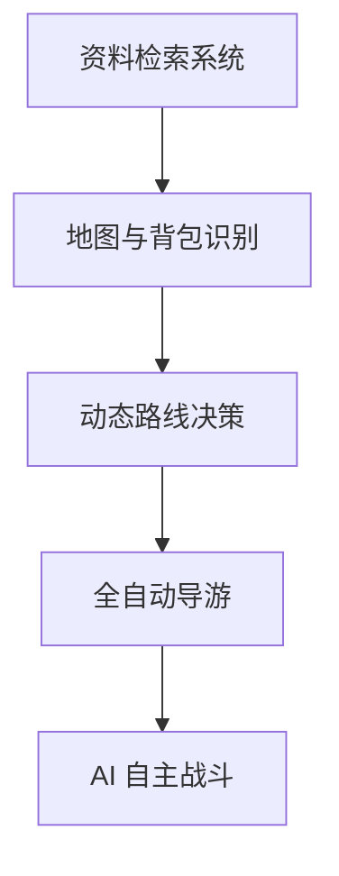
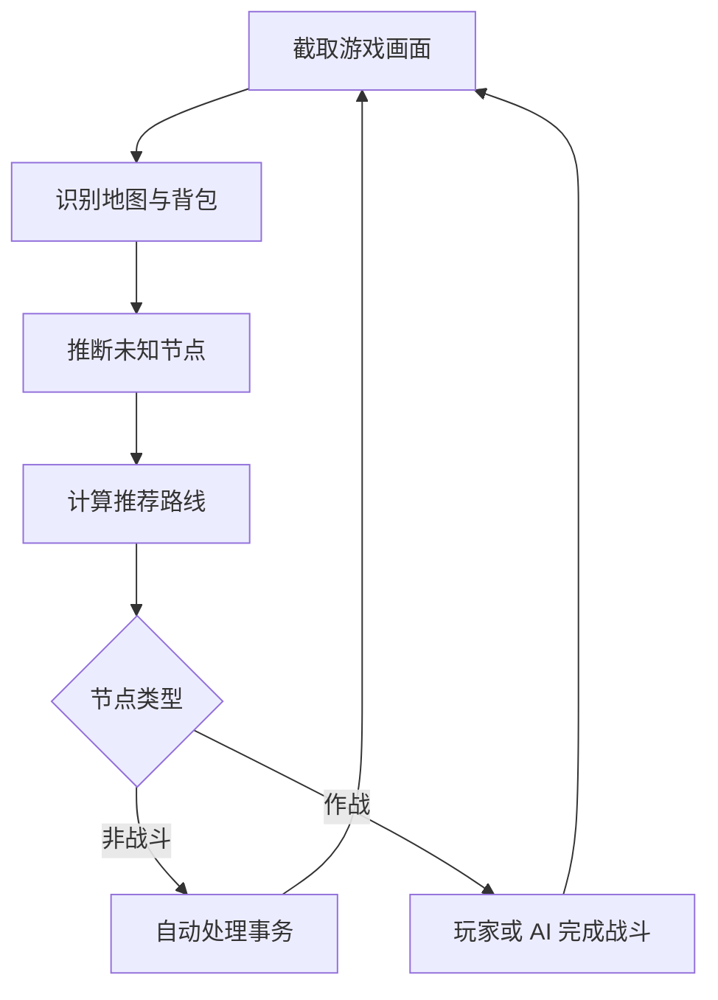

# Blackflow Guide

面向《明日方舟》集成战略“黑流树海”的资料检索、动态路线决策与自动化辅助项目。

> 当前版本以黑流树海资料查询网站为主。地图识别、路线决策和自动化操作仍在开发中，AI 自主战斗属于长期目标。

## 项目简介

Blackflow Guide 的目标，是将黑流树海中分散的零件、零件池、作战、敌人、事件和路线信息整理到统一的网站中，并在此基础上逐步实现动态路线决策与游戏自动化。

项目规划分为三个阶段：

1. 建立可检索的黑流树海资料库。
2. 自动识别当前地图和背包零件，提供动态路线建议，并处理非战斗事务。
3. 由 AI 自主完成作战，实现黑流树海全流程自动探索。



## 当前开发状态

| 模块 | 状态 | 说明 |
|---|---|---|
| 黑流树海资料网站 | ✅ 已完成基础版本 | 提供分类浏览和信息检索 |
| 零件信息查询 | ✅ 已完成基础版本 | 查看零件的基础信息 |
| 零件池查询 | ✅ 已完成基础版本 | 查看零件池及其包含的零件 |
| 全局搜索 | ✅ 已完成基础版本 | 搜索零件、零件池等内容 |
| 作战检索 | ✅ 已完成基础版本 | 查询作战节点和敌人信息 |
| 动态路线与攻略入口 | ✅ 已建立入口 | 后续接入真正的路线决策系统 |
| 地图截图识别 | 🚧 开发中 | 从游戏截图中识别地图与节点 |
| 背包零件识别 | 🚧 开发中 | 自动识别玩家当前持有的零件 |
| 未知节点推断 | 🚧 开发中 | 排查未知的诡秘与未知的凶戾 |
| 动态路线决策 | 🚧 开发中 | 根据当前局面实时推荐路线 |
| 全自动导游 | 📋 计划中 | 自动处理除作战外的探索事务 |
| AI 自主战斗 | 🔭 长期目标 | 自主完成黑流树海作战 |

状态说明：

- ✅ 已完成：已经具备可使用的基础功能。
- 🚧 开发中：正在设计或实现，暂未作为稳定功能提供。
- 📋 计划中：已经确定功能目标，等待后续开发。
- 🔭 长期目标：需要持续研究和多阶段开发。

## 已开发功能

### 零件与零件池查询

网站已经建立零件和零件池的信息查询功能，用户可以：

- 浏览黑流树海零件。
- 查看零件的具体信息。
- 查看不同零件池。
- 查看某个零件池包含的零件。
- 通过搜索快速定位目标零件或零件池。

### 作战检索

作战检索模块用于整理黑流树海中的作战信息，目前主要包括：

- 查询作战节点。
- 查看关卡中的敌人信息。
- 进入动态路线与攻略相关页面。
- 为后续接入地图识别和自主战斗系统提供数据基础。

### 分类浏览与搜索

网站按照功能对资料进行分类，用户既可以通过功能栏浏览，也可以使用搜索功能快速查找相关内容。

目前的网站主要承担两个作用：

1. 为玩家提供黑流树海资料查询服务。
2. 作为未来路线决策与自动化系统的交互界面。

## 开发中：路线决策系统

路线决策系统不会只提供一套固定路线，而是根据玩家当前对局中的地图、零件和资源状态，动态分析不同路线的收益与风险。

### 自动截图与地图识别

系统计划自动截取游戏画面，并识别以下内容：

- 当前所在层数。
- 当前地图结构。
- 已经显现的节点。
- 尚未揭示具体内容的未知节点。
- 节点之间的连接关系。
- 玩家当前可以到达的节点。
- 玩家当前所在位置。
- 已经经过或无法再次进入的节点。

识别结果将被转换为程序可以处理的地图数据，用于后续的节点推断和路线计算。

### 背包零件识别

系统计划自动识别玩家背包中当前持有的零件，并提取会影响路线决策的信息，包括：

- 当前持有的零件。
- 零件所属类型及效果。
- 零件之间可能存在的组合关系。
- 当前还缺少哪些关键零件。
- 哪些节点更可能补充当前构筑所需的零件。

路线决策不会只依据地图距离，而是会同时考虑地图结构和玩家当前构筑。

### 动态路线建议

系统将综合以下信息评估候选路线：

- 当前地图结构。
- 背包中的零件。
- 玩家当前资源。
- 队伍强度和生存状态。
- 不同节点的潜在收益。
- 不同作战的风险。
- 未知节点的可能内容。
- 玩家设定的探索目标。
- 当前构筑的发展方向。
- 后续楼层的路线空间。

当玩家获得新零件、完成事件、进入新区域或揭示未知节点后，系统会重新计算路线，而不是继续执行开局时生成的固定方案。

系统最终将提供：

- 推荐前往的下一节点。
- 推荐路线及候选路线。
- 选择该路线的主要原因。
- 不同路线的风险与预期收益。
- 当前决策依赖的地图和零件信息。

## 未知节点推断

地图上的“未知的诡秘”和“未知的凶戾”不会被简单视为完全随机的节点。

系统计划根据游戏规则和当前对局信息，对每个未知节点进行独立分析。

### 推断依据

可能使用的信息包括：

- 当前所在层数。
- 未知节点的类别。
- 当前地图布局。
- 同一地图上已经出现的节点。
- 已经触发或被排除的事件。
- 不同事件和作战的出现条件。
- 特殊节点之间的互斥或数量限制。
- 当前路线已经揭示的信息。

### 推断结果

系统将为每个未知节点输出：

- 该节点所有仍有可能对应的内容。
- 已被排除的事件或作战。
- 每种可能性的判断依据。
- 节点潜在收益。
- 节点潜在风险。
- 该节点是否值得优先探索。

随着地图信息继续揭示，系统会不断缩小未知节点的可能范围，并及时更新路线建议。

## 计划功能：全自动导游

“全自动导游”是路线决策系统的自动执行模式。

普通模式只向玩家提供路线建议；全自动导游则会根据决策结果，自动完成除作战以外的探索操作。

### 计划实现的操作

- 自动识别当前游戏界面。
- 自动选择并点击下一个节点。
- 自动进入非战斗节点。
- 自动处理“不期而遇”。
- 自动选择“得偿所愿”的合适选项。
- 自动处理“失与得”。
- 自动判断事件选项的收益与代价。
- 自动完成商店购买。
- 自动处理招募和资源获取。
- 自动关闭已经处理完毕的界面。
- 自动确认探索结果。
- 自动进入下一层。
- 在局面发生变化后重新识别地图并规划路线。
- 在异常界面或识别置信度不足时暂停并提示用户。

### 事件选项决策

处理事件时，系统不会始终点击某个固定选项，而是计划结合当前状态进行判断，例如：

- 当前生命值和资源是否足够。
- 某个选项是否会损失关键零件。
- 当前构筑更需要零件、资源还是队伍强化。
- 某项交易是否有利于后续路线。
- 是否正在追求某个特殊事件或结局。
- 当前风险是否处于可以接受的范围。

### 商店购买

自动购买功能计划根据以下因素为商品评分：

- 商品对当前构筑的提升。
- 商品价格。
- 当前剩余资源。
- 后续节点可能需要预留的资源。
- 商品是否属于关键零件。
- 商品与已有零件的配合程度。
- 是否存在性价比更高的购买组合。

系统将先生成购买方案，再按照方案自动完成购买操作。

### 与战斗的衔接

在 AI 自主战斗完成之前，全自动导游只负责非战斗事务。

当系统进入作战节点时，将按照以下流程运行：

1. 识别到即将进入作战。
2. 暂停自动点击。
3. 提示玩家手动完成战斗。
4. 等待战斗结束并返回探索界面。
5. 重新识别地图、背包和资源状态。
6. 更新路线并继续自动探索。

## 长期目标：AI 自主战斗

自主战斗系统的目标，是让 AI 根据实时战场状态完成黑流树海中的作战，而不是单纯回放固定坐标和固定时间的操作脚本。

### 战场识别

系统需要持续识别：

- 当前关卡。
- 地图中的可部署位置。
- 敌人的种类、位置和移动状态。
- 当前部署费用。
- 已部署干员的位置和朝向。
- 待部署干员及其再部署状态。
- 干员生命值。
- 技能是否可以释放。
- 敌人是否接近防线。
- 当前关卡生命值和战斗结果。

### 战斗决策

AI 需要根据识别到的战场状态，自主决定：

- 携带和使用哪些干员。
- 干员的部署顺序。
- 干员的部署位置。
- 干员的部署朝向。
- 技能释放时机。
- 是否撤退并重新部署干员。
- 如何应对临时出现的危险。
- 如何根据当前零件效果调整战术。
- 战斗失败后是否重新尝试或改变策略。

### 策略改进

长期计划包括记录：

- 关卡初始状态。
- 干员阵容和零件构筑。
- 每次部署、撤退和技能操作。
- 关键敌人的到达时间。
- 战斗成功或失败的原因。
- 最终战斗结果。

这些数据可以用于复盘、规则优化、策略搜索，以及后续可能开展的模仿学习或强化学习研究。

## 预期完整工作流程



当所有模块完成后，理想工作流程如下：

1. 系统截取当前游戏画面。
2. 识别地图、节点、背包零件和资源。
3. 分析未知节点的所有可能性。
4. 计算当前最合适的路线。
5. 自动点击目标节点。
6. 自动处理事件、商店和其他非战斗事务。
7. 进入作战后，由自主战斗系统完成战斗。
8. 战斗结束后重新识别当前状态。
9. 持续循环，直到探索结束或完成通关。

## 项目结构

项目将逐步拆分为以下几个核心模块：

| 模块 | 职责 |
|---|---|
| Web 资料库 | 展示零件、零件池、作战、敌人和事件信息 |
| 数据层 | 保存结构化的游戏资料和规则 |
| 图像识别 | 识别游戏界面、地图、节点、背包和战场 |
| 状态管理 | 记录当前探索进度和对局状态 |
| 未知节点推断 | 排查未知节点的可能内容 |
| 路线决策 | 计算路线收益、风险和优先级 |
| 自动控制 | 执行鼠标点击与界面操作 |
| 事件决策 | 选择事件、交易和商店选项 |
| 战斗决策 | 生成并执行战斗策略 |
| 日志与复盘 | 保存识别、决策、操作和战斗结果 |


## 本地运行

> 以下命令适用于常见的 Node.js 前端项目。请以仓库中的 `package.json` 和实际开发环境为准。

### 环境要求

- Git
- Node.js
- npm

### 获取项目

在当前 GitHub 仓库页面点击 **Code**，复制仓库地址，然后执行：

```bash
git clone <仓库地址>
cd blackflow-guide
```

### 安装依赖

```bash
npm install
```

### 启动开发环境

```bash
npm run dev
```

启动成功后，终端会显示本地访问地址。通常可以通过浏览器访问：

```text
http://localhost:5173
```

实际端口以终端输出为准。

### 构建生产版本

```bash
npm run build
```

构建结果的位置以项目配置和终端输出为准。

## 数据与识别原则

为了提高路线决策的可解释性，项目计划尽可能使用结构化规则和明确的数据来源。

系统给出的路线推荐应尽量说明：

- 识别到了哪些地图和背包信息。
- 排除了哪些未知节点可能性。
- 为什么推荐当前路线。
- 哪些信息仍然不确定。
- 当前建议可能受到哪些识别误差影响。

当截图模糊、界面遮挡或识别置信度不足时，系统应暂停自动操作或请求用户确认，避免在不确定状态下连续执行错误操作。

## 当前限制

目前项目仍处于早期开发阶段，需要注意：

- 当前主要可用功能是网站资料检索。
- 路线决策系统尚未完成。
- 地图和背包自动识别尚未作为稳定功能提供。
- 全自动导游尚未完成。
- AI 自主战斗尚未完成。
- 网站资料可能存在遗漏或错误。
- 游戏版本更新可能导致数据、规则或识别方式失效。
- 自动点击功能可能受到分辨率、窗口缩放和界面变化影响。
- 本项目不能保证任何路线建议或自动决策一定获得理想结果。

## 贡献

欢迎通过 GitHub Issue 提交：

- 错误的零件或零件池信息。
- 缺失的事件、作战或敌人数据。
- 网站显示和交互问题。
- 地图识别失败案例。
- 不同分辨率下的界面截图。
- 路线决策规则建议。
- 可复现的程序错误。
- 功能改进建议。

提交问题时，建议附上：

1. 问题发生的页面或功能。
2. 可以复现问题的操作步骤。
3. 预期结果。
4. 实际结果。
5. 游戏版本和网站版本。
6. 必要的截图或日志。

在提交截图前，请检查并移除账号名称、用户编号等不希望公开的信息。

## 免责声明

Blackflow Guide 是非官方的玩家开发项目，与《明日方舟》的开发商、发行商及运营方不存在隶属、授权或合作关系。

《明日方舟》相关名称、图像、角色、界面和其他游戏内容的权利归其各自权利人所有。本项目仅用于资料整理、技术研究与个人学习。

自动化功能可能受到游戏版本更新、界面变化和运行环境差异的影响。使用者应自行判断相关功能是否符合游戏服务条款及所在地区的规定，并自行承担使用风险。

## 开源许可

公开 GitHub 仓库并不自动等同于允许他人复制、修改或重新发布代码。

在正式选择开源许可证之前，项目代码默认保留全部权利。

---

Blackflow Guide 目前仍在持续开发中。

近期重点是完成地图截图识别、背包零件识别、未知节点推断和动态路线决策；全自动导游与 AI 自主战斗将在这些基础能力稳定后继续开发。